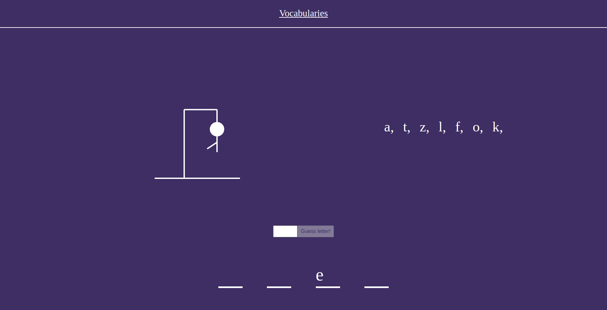

## Hangman
An application created for playing the classic hangman game. It enables to guess English words or German nouns by guessing its letters. 
It is built with React and styled components.
The design was created and responsiveness was accomplished using pure css. 
English word is generated by using the random-words package, while German noun is generated by using the random-noun-generator-german package.

## Project Screenshots

## Project status
The app is finished and deployed at: https://hangman-demo-project.netlify.app

## Installation and Setup Instructions
Clone down this repository. You will need node and npm installed globally on your machine.

To Install:
`npm install`

To Start Server:
`npm start`

To Visit App:
`localhost:3000`

## Reflection
The main project goal was to practice developing an application using the mobile-first approach. 
There is different css for mobiles, tablets and personal computers.
The app has the same functionalities on all of the devices.
One of the goals was to create a very simple design.
